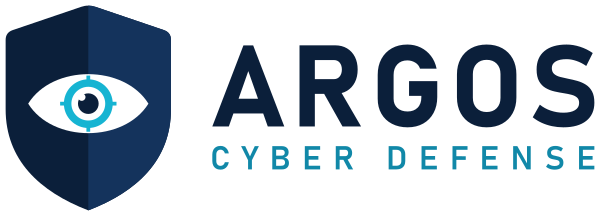

<p align="center">
  
</p>

<p align="center">
  <strong>Detectem, analitzem i prevenim les vulnerabilitats de la vostra infraestructura.</strong>
</p>

<p align="center">
  <a href="https://creativecommons.org/licenses/by-nc-sa/4.0/deed.ca"></a>
  
  
</p>

---

# Argos Cyber Defense

Repositori del **projecte intermodular de 2n curs** del Cicle Formatiu de Grau Superior
d'Administració de Sistemes Informàtics en Xarxa (**ASIX**), perfil professional de
**ciberseguretat**, a l'Institut de l'Ebre (Tortosa).

Conté dues parts:

1. **La web corporativa** (landing page) d'Argos Cyber Defense, publicada amb GitHub Pages.
2. **SentinelX Audit Suite**, l'aplicació d'auditoria de seguretat desenvolupada per l'empresa
   (carpeta [`sentinelx/`](sentinelx/)).

> Argos Cyber Defense, S.L. és una empresa fictícia creada amb finalitats acadèmiques.

## Equip

| Integrant | Rol |
|-----------|-----|
| Razvan Nastasa Ghitau | Scrum Owner |
| Lluc Sarrà Masdeu | Scrum Master |
| Mouhammed Oualy | Scrum Manager |

## Estructura del repositori

```
.
├── index.html                  # Landing page
├── 404.html                    # Pàgina d'error de GitHub Pages
├── site.webmanifest
├── assets/
│   ├── css/style.css           # Estils (colors i tipografia de la guia d'identitat)
│   ├── js/main.js              # Menú, animacions, fotos de l'equip i enllaços a GitHub
│   └── img/
│       ├── logo/               # Logotips i símbol en SVG
│       ├── favicon/            # Favicons i icones per a mòbil
│       └── equip/              # ← FOTOGRAFIES DELS INTEGRANTS
├── descarregues/
│   ├── sentinelx-audit-suite-v1.0.0.zip   # Aplicació SentinelX llesta per descarregar
│   └── argos-kit-identitat-visual.zip     # Logotips i guia d'identitat visual
├── sentinelx/                  # Codi font de l'aplicació SentinelX (Python)
├── LICENSE                     # Text legal de la llicència CC BY-NC-SA 4.0
└── README.md
```

## Fotografies de l'equip

Pugeu les fotografies a la carpeta [`assets/img/equip/`](assets/img/equip/) amb aquests noms
exactes (en minúscules):

| Integrant | Fitxer |
|-----------|--------|
| Razvan Nastasa Ghitau | `assets/img/equip/razvan.jpg` |
| Lluc Sarrà Masdeu | `assets/img/equip/lluc.jpg` |
| Mouhammed Oualy | `assets/img/equip/mouhammed.jpg` |

Es recomana una imatge quadrada d'uns 600 × 600 px. També s'accepten `.jpeg`, `.png` i `.webp`
amb el mateix nom. Mentre no hi hagi fotografia, la web mostra les inicials.

## Publicar la web amb GitHub Pages

1. Creeu un repositori nou a GitHub (per exemple, `argos-cyber-defense`) i pugeu-hi tot el
   contingut d'aquesta carpeta (**Add file → Upload files**).
2. Aneu a **Settings → Pages**.
3. A **Build and deployment → Source**, trieu **Deploy from a branch**.
4. Seleccioneu la branca **`main`** i la carpeta **`/ (root)`** i premeu **Save**.
5. Al cap d'un o dos minuts, la web estarà disponible a
   `https://<usuari>.github.io/<repositori>/`.

Els enllaços de la web cap al codi font de GitHub es generen automàticament a partir d'aquesta
adreça, no cal editar res.

## SentinelX Audit Suite

Aplicació d'escriptori en Python (CustomTkinter) per fer auditories de seguretat: descobriment
d'equips i serveis amb nmap, auditoria i reforçament del sistema local, correlació de
vulnerabilitats amb CVE (diccionari local, NVD API i scripts NSE) i generació d'informes en
HTML, PDF, JSON i CSV.

Inici ràpid a Ubuntu 24.04 / 26.04 LTS:

```bash
cd sentinelx
chmod +x install_dependencies.sh
./install_dependencies.sh
source venv/bin/activate
python main.py
```

Tota la documentació és a [`sentinelx/README.md`](sentinelx/README.md) i
[`sentinelx/QUICKSTART.md`](sentinelx/QUICKSTART.md).

> **Avís legal i ètic:** SentinelX s'ha d'utilitzar exclusivament sobre xarxes i sistemes per
> als quals es disposi d'autorització expressa i per escrit. L'ús no autoritzat sobre sistemes
> de tercers pot constituir un delicte.

## Formulari de sol·licitud d'auditoria

Els botons **Sol·licita una auditoria** obren un formulari. Les respostes s'envien per correu
electrònic a `llucsarra@iesebre.com` a través de [FormSubmit](https://formsubmit.co), un servei
gratuït que no necessita compte ni servidor propi.

- La **primera vegada** que s'envia el formulari des de la web publicada, FormSubmit envia un
  correu de confirmació a aquesta adreça: cal obrir-lo i prémer **Activate Form**. A partir
  d'aquí, cada sol·licitud arriba com un correu amb totes les dades en una taula.
- Per canviar el correu de destinació, modifiqueu els atributs `action` i `data-contact` del
  formulari a `index.html`.

## Seguretat de la web

La landing page és completament estàtica i no carrega cap recurs extern: no hi ha galetes,
analítiques, tipus de lletra ni scripts de tercers. Inclou una política de seguretat de
contingut (*Content Security Policy*) que només permet carregar recursos del mateix domini;
l'única connexió externa permesa és l'enviament del formulari a FormSubmit.

## Llicència

<a rel="license" href="https://creativecommons.org/licenses/by-nc-sa/4.0/deed.ca"></a>

© 2026 Razvan Nastasa Ghitau, Lluc Sarrà Masdeu i Mouhammed Oualy.

Aquest repositori (web, aplicació SentinelX, logotips i documentació) està subjecte a una
llicència [Creative Commons Reconeixement-NoComercial-CompartirIgual 4.0 Internacional
(CC BY-NC-SA 4.0)](https://creativecommons.org/licenses/by-nc-sa/4.0/deed.ca). Podeu
compartir-lo i adaptar-lo sempre que:

- **Reconeixement (BY):** en citeu els autors i indiqueu si hi heu fet canvis.
- **NoComercial (NC):** no el feu servir amb finalitats comercials.
- **CompartirIgual (SA):** distribuïu les obres derivades amb aquesta mateixa llicència.

El text legal complet és al fitxer [`LICENSE`](LICENSE).
